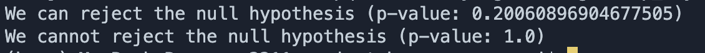
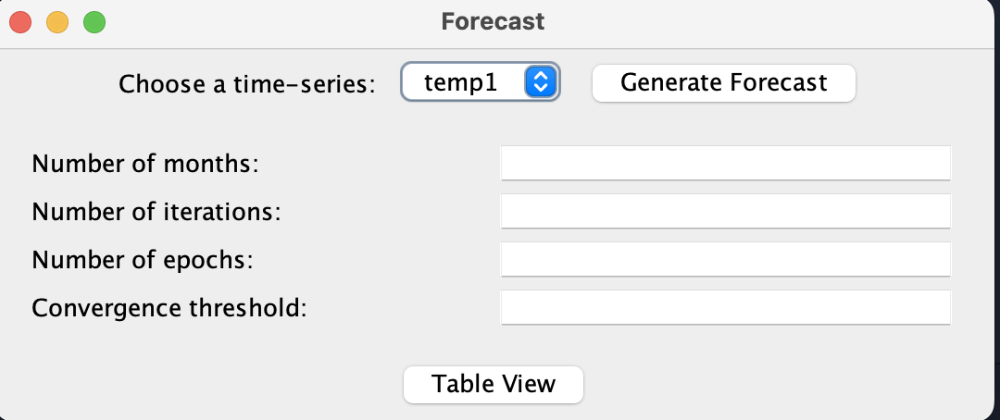

# Project Bravo

This repository details the work of Team Bravo's Housing Price Statistical and ML Application for EECS 3311.

## Group Members

- Aryan Soni
- Onkar Saund
- Manmeet Walia
- Mikail Karimi-Shahidi

## Deliverable 1

The following screenshots demonstrate our progress in Deliverable 1. Please refer to our code for additional context.

### Data Tabulation

This portion of our deliverable revolved around extracting the values from the CSV file, feeding them into a local SQL database, then querying the local SQL database and tabulating the values into a raw table. Note that the rightmost column name in the below screenshot should be NHPI, not NRPI (minor typo).

### Visualization

This visualization demonstrates how we can visually compare NHPI values. The example here shows the NHPI values from Ontario and Alberta from 1999 to 2015 being compared.

### Comparison

This portion of the deliverable revolved around performing a statistical T-Test between two time series. The examples shown here show our console input in two different situations, one where the null hypothesis is rejected, and one where it isn't.

### Views

The final bit of work in this deliverable was setting up our basic views. Note that some our views use template code/data. As confirmed with Professor Fokaefs, this is permitted as a proof of concept for Deliverable 1.

Form View

Table View

Visualization View

Comparison View

Forecast View

**Final Note:** Setting up the database locally requires specific local configurations. Professor Fokaefs mentioned that it is not neccessary to provide instructions for specific local configurations, as we will be demo'ing the project in a later deliverable. Nonetheless, if further clarity is required, please contact any one of our group members.
